# Day 2: Data Visualization in `R`

**FSU Summer Methods School**

Therese Anders

5/7/2019


# Why data wrangling in a visualization workshop?
This workshop focuses on data visualization. However, in practice, data visualization is only the last part in a long stream of data gathering, cleaning, wrangling, and analysis. 


`ggplot2` is the most powerful when we have "tidy" data. There are three rules for tidy data, based on Hadley Wickham's [R for Data Science](https://r4ds.had.co.nz/tidy-data.html).

1. "Each variable must have its own column."
2. "Each observation must have its own row."
3. "Each value must have its own cell."

If the data are in a tidy format, we can pass separate variables to separate aesthetics and create layered displays of multiple variables. Thus an important component of creating interesting data visualizations is to get the data to be in the right format. We will also learn a number of new data visualization tools as part of the data wrangling section, including

* Bar charts
* Error bars on plots

RStudio offers a great [Data wrangling cheat sheet](https://www.rstudio.com/wp-content/uploads/2015/02/data-wrangling-cheatsheet.pdf) you should take a look at.

# Introduction to `dplyr`
`dplyr` does not accept tables or vectors, just data frames (similar to `ggplot2`)! `dplyr` uses a strategy called "Split - Apply - Combine". Some of the key functions include:

* `select()`: Subset columns.
* `filter()`: Subset rows.
* `arrange()`: Reorders rows.
* `mutate()`: Add columns to existing data.
* `summarise()`: Summarizing data set.
* joins: Combine two data frames together

First, lets dowload the package and call it using the `library()` function.

```r
# install.packages("dplyr")
library(dplyr)
```

Today, we will be working with a data set from the `hflights` package. The data set contains all flights from the Houston IAH and HOU airports in 2011. Install the package `hflights`, load it into the library, extract the data frame into a new object called `raw` and inspect the data frame.

**NOTE:** The `::` operator specifies that we want to use the *object* `hflights` from the *package* `hflights`. In the case below, this explicit programming is not necessary. However, it is useful when functions or  objects are contained in multiple packages to avoid confusion. A classic example is the `select()` function that is contained in a number of packages besides `dplyr`.

```r
# install.packages("hflights")
library(hflights)
raw <- hflights::hflights
str(raw)
```

```
## 'data.frame':	227496 obs. of  21 variables:
##  $ Year             : int  2011 2011 2011 2011 2011 2011 2011 2011 2011 2011 ...
##  $ Month            : int  1 1 1 1 1 1 1 1 1 1 ...
##  $ DayofMonth       : int  1 2 3 4 5 6 7 8 9 10 ...
##  $ DayOfWeek        : int  6 7 1 2 3 4 5 6 7 1 ...
##  $ DepTime          : int  1400 1401 1352 1403 1405 1359 1359 1355 1443 1443 ...
##  $ ArrTime          : int  1500 1501 1502 1513 1507 1503 1509 1454 1554 1553 ...
##  $ UniqueCarrier    : chr  "AA" "AA" "AA" "AA" ...
##  $ FlightNum        : int  428 428 428 428 428 428 428 428 428 428 ...
##  $ TailNum          : chr  "N576AA" "N557AA" "N541AA" "N403AA" ...
##  $ ActualElapsedTime: int  60 60 70 70 62 64 70 59 71 70 ...
##  $ AirTime          : int  40 45 48 39 44 45 43 40 41 45 ...
##  $ ArrDelay         : int  -10 -9 -8 3 -3 -7 -1 -16 44 43 ...
##  $ DepDelay         : int  0 1 -8 3 5 -1 -1 -5 43 43 ...
##  $ Origin           : chr  "IAH" "IAH" "IAH" "IAH" ...
##  $ Dest             : chr  "DFW" "DFW" "DFW" "DFW" ...
##  $ Distance         : int  224 224 224 224 224 224 224 224 224 224 ...
##  $ TaxiIn           : int  7 6 5 9 9 6 12 7 8 6 ...
##  $ TaxiOut          : int  13 9 17 22 9 13 15 12 22 19 ...
##  $ Cancelled        : int  0 0 0 0 0 0 0 0 0 0 ...
##  $ CancellationCode : chr  "" "" "" "" ...
##  $ Diverted         : int  0 0 0 0 0 0 0 0 0 0 ...
```

## Using `select()` and introducing the Piping Operator `%>%`
Using the so-called **piping operator** will make the `R` code faster and more legible, because we are not saving every output in a separate data frame, but passing it on to a new function. First, let's use only a subsample of variables in the data frame, specifically the year of the flight, the airline, as well as the origin airport, the destination, and the distance between the airports.

Notice a couple of things in the code below:

* We can assign the output to a new data set.
* We use the piping operator to connect commands and create a single flow of operations.
* We can use the select function to rename variables.
* Instead of typing each variable, we can select sequences of variables.
* Note that the `everything()` command inside `select()` will select all variables.


```r
data <-  raw %>%
  dplyr::select(Month,
                DayOfWeek,
                DepTime,
                ArrTime,
                ArrDelay,
                TailNum,
                Airline = UniqueCarrier, #Renaming the variable
                Time = ActualElapsedTime, #Renaming the variable
                Origin:Cancelled) #Selecting a number of columns. 
names(data)
```

```
##  [1] "Month"     "DayOfWeek" "DepTime"   "ArrTime"   "ArrDelay" 
##  [6] "TailNum"   "Airline"   "Time"      "Origin"    "Dest"     
## [11] "Distance"  "TaxiIn"    "TaxiOut"   "Cancelled"
```

Suppose, we didn't really want to select the `Cancelled` variable. We can use `select()` to drop variables.

```r
data <- data %>%
  dplyr::select(-Cancelled)
```

## Introducting `filter()`
There are a number of key operations when manipulating observations (rows).

* `x < y`
* `x <= y`
* `x == y`
* `x != y`
* `x >= y`
* `x > y`
* `x %in% c(a,b,c)` is `TRUE` if `x` is in the vector `c(a, b, c)`.

Suppose, we wanted to filter all the flights that have their destination in the greater Los Angeles area, specifically Los Angeles (LAX), Ontario (ONT), and John Wayne (SNA) airports. Note that based on the `hflights` dataset, there are no flights from the Houston area to Bob Hope (BUR) or Long Beach (LGB) airports.

```r
airports <- c("LAX", "ONT", "SNA")

la_flights <- data %>%
  filter(Dest %in% airports)
```

**Caution**: The following command does not return the flights to LAX or ONT!

```r
head(la_flights)
```

```
##   Month DayOfWeek DepTime ArrTime ArrDelay TailNum Airline Time Origin
## 1     1         1    1916    2103        2  N76522      CO  227    IAH
## 2     1         1     747     936        5  N67134      CO  229    IAH
## 3     1         1    1433    1629       14  N73283      CO  236    IAH
## 4     1         1    1750    1921        6  N34282      CO  211    IAH
## 5     1         1     917    1120       15  N76515      CO  243    IAH
## 6     1         1    1550    1736        8  N76502      CO  226    IAH
##   Dest Distance TaxiIn TaxiOut
## 1  LAX     1379      8      20
## 2  LAX     1379     11      17
## 3  LAX     1379     10      27
## 4  ONT     1334      5      17
## 5  SNA     1347      6      35
## 6  LAX     1379     13      15
```

```r
la_flights_alt <- data %>%
  filter(Dest == c("LAX", "ONT"))
head(la_flights_alt)
```

```
##   Month DayOfWeek DepTime ArrTime ArrDelay TailNum Airline Time Origin
## 1     1         1    1916    2103        2  N76522      CO  227    IAH
## 2     1         1    1433    1629       14  N73283      CO  236    IAH
## 3     1         1    2107    2247        7  N73270      CO  220    IAH
## 4     1         1     920    1116        5  N77867      CO  236    IAH
## 5     1         1    1325    1538       32  N26210      CO  253    IAH
## 6     1         1    1749    1938        6  N73860      CO  229    IAH
##   Dest Distance TaxiIn TaxiOut
## 1  LAX     1379      8      20
## 2  LAX     1379     10      27
## 3  LAX     1379      7      12
## 4  LAX     1379      8      33
## 5  LAX     1379     11      30
## 6  LAX     1379     15      14
```

Why? We are basically returning all values for which the following is `TRUE` (using the correct output of the `la_flights` data frame:

`Dest[1] == LAX`

`Dest[2] == ONT`

`Dest[3] == LAX`

`Dest[4] == ONT` ...


## Introducting `mutate()`
Currently, we have two taxi time variables in our data set: `TaxiIn` and `TaxiOut`. I care about total taxi time, and want to add the two together. Also, people hate sitting in planes while it is not in the air. To see how much time is spent taxiing versus flying, we create a variable which measures the proportion of taxi time of total time of flight.

```r
la_flights <- data %>%
  filter(Dest %in% airports) %>%
  mutate(TaxiTotal = TaxiIn + TaxiOut,
         TaxiProp = TaxiTotal/Time)
```

We can the graph the average proportion of taxi time per airline. 

```r
library(ggplot2)
ggplot(la_flights,
       aes(x = Airline,
           y = TaxiProp)) +
  geom_boxplot()
```

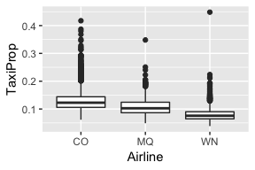<!-- -->

There is only three airlines flying to LA out of Houston. Lets create a new variable with the airline name using the `case_when()` function to make the graph more informative.

```r
table(la_flights$Airline)
```

```
## 
##   CO   MQ   WN 
## 6471  810 1396
```

```r
la_flights <- data %>%
  filter(Dest %in% airports) %>%
  mutate(TaxiTotal = TaxiIn + TaxiOut,
         TaxiProp = TaxiTotal/Time,
         AirlineName = case_when(
           Airline == "CO" ~ "Continental Airlines",
           Airline == "MQ" ~ "American Eagle",
           Airline == "WN" ~ "Southwest Airlines"
         ))

ggplot(la_flights,
       aes(x = AirlineName,
           y = TaxiProp)) +
  geom_boxplot() +
  coord_flip() +
  labs(title = "Time spent taxiing",
       x = "Taxiing/flight duration",
       y = "") +
  theme_light()
```

<!-- -->

## Introducting `summarise()` and `arrange()`
One of the most powerful `dplyr` features is the `summarise()` function, especially in combination with `group_by()`.

First, in a simple example, lets compute the average delay from Houston to Los Angeles by each day of the week. Note that the arrival delay variable is given in minutes. Also, I want to know what standard deviation of the delay is for each day of the weak. Note, that because there are missing values, we need to tell `R` what to do with them.

```r
la_flights_delay <- la_flights %>%
  group_by(DayOfWeek) %>%
  summarise(av_delay = mean(ArrDelay, na.rm = T),
            sd_delay = sd(ArrDelay, na.rm = T))
```

We can use error bars to show the standard deviation of the delay time for each day of the weak. I add a line to denote no delay using the `geom_hline()` aesthetic.

```r
ggplot(la_flights_delay,
       aes(x = DayOfWeek,
           y = av_delay,
           ymin = av_delay - sd_delay,
           ymax = av_delay + sd_delay)) +
  geom_point() +
  geom_errorbar() +
  geom_hline(yintercept = 0,
             linetype = "dashed") +
  
  # Making the graph prettier
  scale_x_continuous(breaks = seq(1,7)) +
  theme_light() +
  labs(y = "Average delay (with 1SD)",
       x = "Day",
       title = "Arrival delay") +
  coord_flip()
```

<!-- -->

Suppose, I wanted to know whether some airlines have on average shorter arrival delays than others. We can add the airline to the `group_by()` function to compute the mean and standard deviation of arrival delay per day and airline. 

```r
la_flights_delay_airline <- la_flights %>%
  group_by(DayOfWeek, AirlineName) %>%
  summarise(av_delay = mean(ArrDelay, na.rm = T),
            sd_delay = sd(ArrDelay, na.rm = T))

# Plotting it
ggplot(la_flights_delay_airline,
       aes(x = DayOfWeek,
           y = av_delay,
           ymin = av_delay - sd_delay,
           ymax = av_delay + sd_delay,
           color = AirlineName)) +
  geom_point() +
  geom_errorbar() +
  geom_hline(yintercept = 0,
             linetype = "dashed") +
  
  # Making graph prettier
  theme_light() +
  coord_flip() +
  scale_x_continuous(breaks = seq(1,7))
```

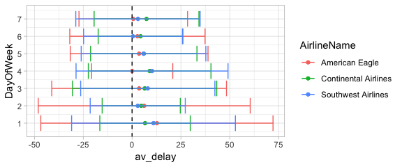<!-- -->

To de-clutter the graph, below, I use the `geom_linerange()` aesthetic rather than `geom_errorbar()`. I can use the `position = dodge` command within the `geom_point()` and `geom_linerange()` aesthetic to display the values for each airline next to each other, instead on top of each other. Note that I could have used `position = dodge` with `geom_errorbar()` as well; the functionality is essentially the same.

```r
ggplot(la_flights_delay_airline,
       aes(x = DayOfWeek,
           y = av_delay,
           ymin = av_delay - sd_delay,
           ymax = av_delay + sd_delay,
           color = AirlineName)) +
  geom_point(position = position_dodge(width = 0.5)) +
  geom_linerange(position = position_dodge(width = 0.5),
                 alpha = 0.5) +
  geom_hline(yintercept = 0,
             linetype = "dashed") +
  
  # Making graph prettier
  theme_light() +
  coord_flip() +
  scale_x_continuous(breaks = seq(1,7)) +
  
  # Matching order of legend and graph
  guides(color = guide_legend(reverse = T))
```

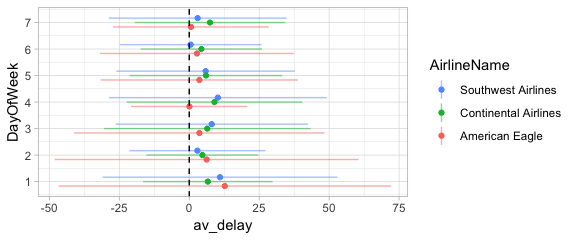<!-- -->


## Joins
`dplyr` has powerful tools to merge data frames together. Because we want to focus on data visualization here, I will not go over all possible joints in depth. Please see the [Data Wrangling Cheat Sheet](https://www.rstudio.com/wp-content/uploads/2015/02/data-wrangling-cheatsheet.pdf) and the [dplyr documentation](https://dplyr.tidyverse.org/reference/join.html) for more details.

Suppose, we have two data frames: `x` and `y`. The basic syntax for data merging with `dplyr` is the following:

`output <- join(A, B, by = "variable")`

We will focus on the following three join functions:

* `left_join()`: Join only those rows from `y` that appear in `x`, retaining all data in `x`. Here, `x` is the "master."
* `right_join()`: Join only those rows from `x` that appear in `y`, retaining all data in `y`. Here, `y` is the "master."
* `full_join()`: Join data from `x` and `y` upon retaining all rows and values. This is the maximum join possible. Neither `x` nor `y` is the "master."


For demonstration purposes, lets create a new data frame that contains the name of the city for each of the Greater Los Angeles Area airports.

```r
loc_airport <- data.frame(code = c("LAX", "ONT", "SNA", "BUR"),
                          location = c("Los Angeles", "Ontario", "Santa Ana", "Burbank"))
loc_airport
```

```
##   code    location
## 1  LAX Los Angeles
## 2  ONT     Ontario
## 3  SNA   Santa Ana
## 4  BUR     Burbank
```


First, we treat the `la_flights` data frame as the master and join it with the data frame containing the airport locations using `left_join()`. If the variable names in both data frames were the same, `dplyr` would automatically join the correct columns. Here, we manually match the column names.

```r
la_flights_new <- left_join(la_flights, loc_airport, 
                            by = c("Dest" = "code"))
```

```
## Warning: Column `Dest`/`code` joining character vector and factor, coercing
## into character vector
```

```r
table(la_flights_new$Dest)
```

```
## 
##  LAX  ONT  SNA 
## 6064  952 1661
```

Second, lets create a similar result using `right_join()`. Again, `la_flights` is the master data frame.

```r
la_flights_new2 <- right_join(loc_airport, la_flights, 
                              by = c("code" = "Dest"))
```

```
## Warning: Column `code`/`Dest` joining factor and character vector, coercing
## into character vector
```

```r
table(la_flights_new2$code)
```

```
## 
##  LAX  ONT  SNA 
## 6064  952 1661
```

Finally, for demonstration, we create a third data frame using `full_join()`. Because all observations are retained, this join creates one observation with empty values for the Burbank value in `loc_airport`. For most applications, this would be an undesirable outcome. However, below, we use the fact that all possible values are retained to set up the data for visualization.

```r
la_flights_new3 <- full_join(la_flights, loc_airport, 
                            by = c("Dest" = "code"))
```

```
## Warning: Column `Dest`/`code` joining character vector and factor, coercing
## into character vector
```

```r
table(la_flights_new3$Dest)
```

```
## 
##  BUR  LAX  ONT  SNA 
##    1 6064  952 1661
```

```r
la_flights_new3[la_flights_new3$Dest == "BUR",]
```

```
##      Month DayOfWeek DepTime ArrTime ArrDelay TailNum Airline Time Origin
## 8678    NA        NA      NA      NA       NA    <NA>    <NA>   NA   <NA>
##      Dest Distance TaxiIn TaxiOut TaxiTotal TaxiProp AirlineName location
## 8678  BUR       NA     NA      NA        NA       NA        <NA>  Burbank
```


# Heatmaps
For this example, we will go back to our original `data` tibble that contains the complete set of flight data for the Houston airports in 2011. Suppose we wanted to know, what are the busiest times at each of the two Houston airports, George Bush Intercontinental/Houston Airport (IAH) and William P. Hobby Airport (HOU). We create a new summary data frame that counts the number of departures per hour and day for each of the airports. We display these data using heatmaps.

To do so, we need to create a new variable that codes the hour of departure, using information from the `DepTime` variable. There are more advanced workflows available using the `stringr` and/or `lubridate` packages (both are part of the `tidyverse`). However, because we want to focus on data visualization, I simply divide the departure time by 100 and then use the `floor()` function to extract the hour of departure.

```r
departures <- data %>%
  
  dplyr::mutate(hour = floor(DepTime/100))  %>%
  
  group_by(DayOfWeek,
           hour) %>%
  summarise(count = n())

ggplot(departures,
       aes(x = hour,
           y = DayOfWeek,
           fill = count)) +
  geom_tile()
```

<!-- -->

There are a number of ways to improve the plot. We will go through them step by step. Their is a weird observation in hour 24 that should not be there. The hour has to be either 23 or 0. Lets re-code this observation to an hour value of 0 using the `replace()` function from `dplyr`.

```r
test <- data %>%
  filter(!is.na(DepTime)) %>%
  mutate(hour = floor(DepTime/100)) %>%
  filter(hour >= 24)
test
```

```
##   Month DayOfWeek DepTime ArrTime ArrDelay TailNum Airline Time Origin
## 1     5         2    2400     144      310  N14940      XE  104    IAH
##   Dest Distance TaxiIn TaxiOut hour
## 1  DFW      224      8      17   24
```

```r
# Recoding
departures <- data %>%
  filter(!is.na(DepTime)) %>%
  mutate(hour = floor(DepTime/100))  %>%
  mutate(hour = replace(hour, hour >= 24, 0)) %>%
  group_by(Origin,
           DayOfWeek,
           hour) %>%
  summarise(count = n())

ggplot(departures,
       aes(x = hour,
           y = DayOfWeek,
           fill = count)) +
  geom_tile() 
```

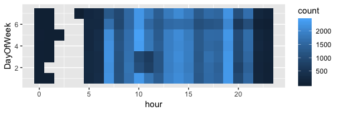<!-- -->

There are a number of possible observations that do not have value in the data frame, in particular in the early morning ours. For this application, we can assume that that these observations are not actually missing, but that there are no flights during these time slots. 

Therefore, we create a data frame with all possible combinations of the variable values for day of the week and hour using `expand.grid()`, and use the `full_join()` function to create a new data frame. Similar to the application above, this procedure will result in missing values. We again use the `replace` function to re-code these missing values to zero.

```r
# Empty data frame
combo <- expand.grid(DayOfWeek = seq(1, 7),
                     hour = seq(0,23),
                     Origin = c("IAH", "HOU"))

# Merging
departures <- data %>%
  filter(!is.na(DepTime)) %>%
  mutate(hour = floor(DepTime/100))  %>%
  mutate(hour = replace(hour, hour >= 24, 0)) %>%
  group_by(Origin,
           DayOfWeek,
           hour) %>%
  summarise(count = n()) %>%
  
  # joining empty data frame
  full_join(combo) %>%
  
  # replacing missing values with zero
  mutate(count = replace(count, is.na(count), 0))

# visualizing it
ggplot(departures,
       aes(x = hour,
           y = DayOfWeek,
           fill = count)) +
  geom_tile() 
```

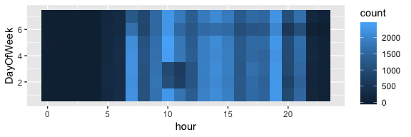<!-- -->

Now, lets change the appearance of the graph. Below, we use color scales from the `viridis` package.

```r
# install.packages("viridis")
library(viridis)


# visualizing it
ggplot(departures,
       aes(x = hour,
           y = DayOfWeek,
           fill = count)) +
  
  geom_tile(color = "white") +
  scale_fill_viridis(name = "Flights") +
  scale_x_continuous(breaks = seq(0,23)) +
  scale_y_continuous(breaks = seq(1,7),
                     labels = c("Sun", "Mon", "Tue", "Wed", "Thu", "Fri", "Sat")) +

  coord_flip() +
  labs(x = "Hour",
       y = "",
       title = "Departures from Houston airports") +
  
  # Changing appearance of the plot
  theme_light() +
  theme(panel.grid = element_blank(),
        legend.position = "bottom",
        legend.key.width = unit(1.5, "cm"),
        panel.border=element_blank()) +
  
  # Making the space equal by fixing aspect ratio 
  # Reducing space
  coord_fixed(expand = c(0,0))
```

<!-- -->

```r
table(departures$DayOfWeek)
```

```
## 
##  1  2  3  4  5  6  7 
## 48 48 48 48 48 48 48
```

# Alluvial diagrams
What are the flows between the two Houston airports and the ten most common destinations? We can visualize the combination of origin airport (IAH versus HOU) and the destination airport using alluvial diagrams. Below, we use the `ggalluvial` package, which contains the `geom_alluvium()` aesthetic. 

First, we create a frequency table for all observed combinations of origin and destination airport for the ten most common destinations using `group_by()` and `slice()`.

```r
dest_top10 <- data %>%
  group_by(Dest) %>%
  summarise(count = n()) %>%
  arrange(desc(count)) %>%
  slice(1:10)

flows <- data %>%
  filter(Dest %in% dest_top10$Dest) %>%
  group_by(Origin, 
           Dest,
           Airline) %>%
  summarise(count = n())

# install.packages("ggalluvial")
library(ggalluvial)
ggplot(flows,
       aes(y = count,
           axis1 = Origin, 
           axis2 = Dest)) +
  geom_alluvium()
```

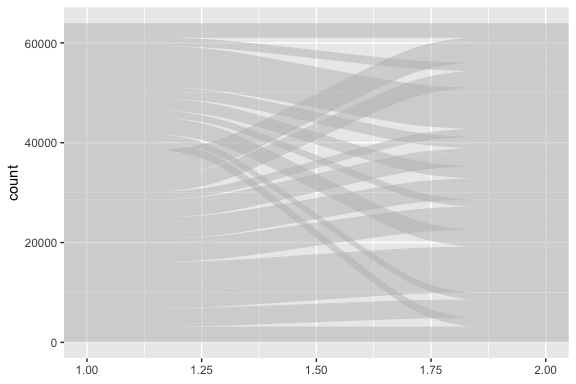<!-- -->

We can use fill to make the graph more interesting.

```r
ggplot(flows,
       aes(y = count,
           axis1 = Origin, 
           axis2 = Dest)) +
  geom_alluvium(aes(fill = Origin))
```

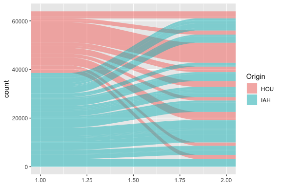<!-- -->

We can add labels to illustrate the destination airport. We also add the `geom_stratum()` aesthetic to clarify the grouping.

```r
ggplot(flows,
       aes(y = count,
           axis1 = Origin, 
           axis2 = Dest)) +
  geom_alluvium(aes(fill = Origin)) +
  geom_stratum(width = 1/12, fill = "black", color = "grey") +
  geom_label(stat = "stratum", label.strata = TRUE)
```

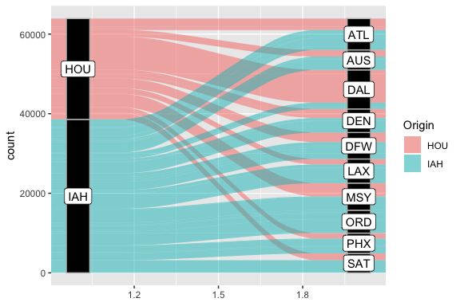<!-- -->

The plot above looks nice, but the distinction by fill is not necessarily needed. We could instead display an additional variable, for example the airline. 


```r
ggplot(flows,
       aes(y = count,
           axis1 = Origin, 
           axis2 = Dest)) +
  geom_alluvium(aes(fill = Airline)) +
  geom_stratum(width = 1/12, fill = "black", color = "grey") +
  geom_label(stat = "stratum", label.strata = TRUE)
```

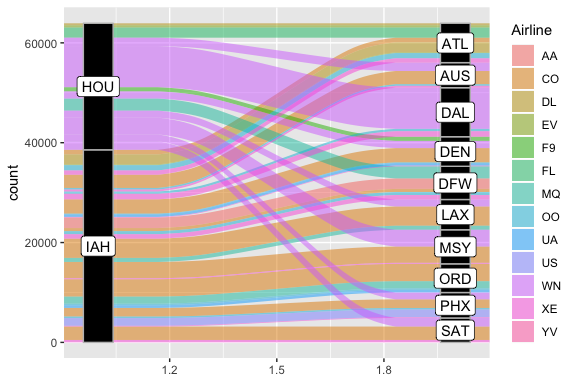<!-- -->

The plot above is hardly legible because there are too many airlines displayed. Lets only label the most common ones. First, we create a quick barplot to check who are the most common carriers on the top ten routes. Then, create a new variable coding only the most common, i.e. Continental (CO), Southwest (WN), and Other using `case_when()`.

```r
ggplot(flows,
       aes(x = Airline,
           y = count)) +
  geom_bar(stat = "identity")
```

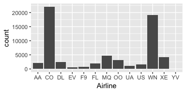<!-- -->

```r
# Creating new indicator
flows <- flows %>%
  mutate(Airline_reduced = case_when(
    Airline == "CO" ~ "Continental",
    Airline == "WN" ~ "Southwest",
    T ~ "Other"
  ) %>% factor(levels = c('Continental', 'Southwest', 'Other')))
table(flows$Airline_reduced)
```

```
## 
## Continental   Southwest       Other 
##           9           7          30
```

Now, we can re-plot the alluvial diagram.

```r
ggplot(flows,
       aes(y = count,
           axis1 = Origin, 
           axis2 = Dest)) +
  geom_alluvium(aes(fill = Airline_reduced)) +
  geom_stratum(width = 1/12, fill = "black", color = "grey") +
  geom_label(stat = "stratum", label.strata = TRUE) +
  scale_fill_manual(name = "Airline",
                    values = c("Continental" = "blue",
                               "Southwest" = "darkorange",
                               "Other" = "grey")) +
  theme_light() +
  labs(title = "Flights from Houston 2011",
       x = "",
       y = "Number of flights") +
  theme(axis.text.x = element_blank())
```

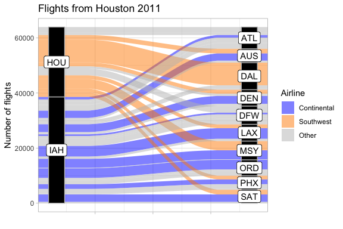<!-- -->

# Primer on `tidyr`
Another important task in data management is data re-shaping. Often, data does not come in the format that we need for data merging, data visualization, statistical analysis, or vectorized programming.

The `tidyr` package offers two main functions for data re-shaping:

* `gather()`: Shaping data from wide to long.
* `spread()`: Shaping data from long to wide.

## Wide versus long data
For **wide** data formats, each unit's responses are in a single row. For example:

| Country | Area | Pop1990 | Pop1991 |
|---------|------|---------|---------|
| A       | 300  | 56      | 58      |
| B       | 150  | 40      | 45      |

For **long** data formats, each row denotes the observation of a unit at a given point in time. For example:

| Country | Year | Area | Pop |
|---------|------|------|-----|
| A       | 1990 | 300  | 56  |
| A       | 1991 | 300  | 58  |
| B       | 1990 | 150  | 40  |
| B       | 1991 | 150  | 45  |

## `gather()`
We use the `gather()` function to reshape data from wide to long. In general, the syntax of the data is as follows:

`new_df <- gather(old_df, key, value, columns to gather)`,

where `key` specifies the column name of the variable capturing variable labels (i.e. the original names of the columns to be re-shaped) and `value` the column values to be stored.

Below, we use the `murder_2015_final` data set from the `fivethirtyeight` package. The data contains number of murders in 83 U.S. cities. The dataset contains a column `murder_2014` and a column `murder_2015`. For tidy data, we want one observation per row and one variable per column. The data is untidy because the two columns confuse the variables `murder` and `year. 

Below, we use `gather()` to tidy the data. For illustration we drop the variable change to show how to re-create it.


```r
# install.packages("tidyr")
library(tidyr)

# install.packages("fivethirtyeight")
library(fivethirtyeight)
murder <- fivethirtyeight::murder_2015_final
head(murder)
```

```
## # A tibble: 6 x 5
##   city       state     murders_2014 murders_2015 change
##   <chr>      <chr>            <int>        <int>  <int>
## 1 Baltimore  Maryland           211          344    133
## 2 Chicago    Illinois           411          478     67
## 3 Houston    Texas              242          303     61
## 4 Cleveland  Ohio                63          120     57
## 5 Washington D.C.               105          162     57
## 6 Milwaukee  Wisconsin           90          145     55
```

```r
# using gather to re-shape 
murder_tidy <- murder %>%
  dplyr::select(-change) %>%
  gather(murders_year, value, murders_2014:murders_2015) 
head(murder_tidy)
```

```
## # A tibble: 6 x 4
##   city       state     murders_year value
##   <chr>      <chr>     <chr>        <int>
## 1 Baltimore  Maryland  murders_2014   211
## 2 Chicago    Illinois  murders_2014   411
## 3 Houston    Texas     murders_2014   242
## 4 Cleveland  Ohio      murders_2014    63
## 5 Washington D.C.      murders_2014   105
## 6 Milwaukee  Wisconsin murders_2014    90
```

We can use the `separate()` function from the `tidyr` package to turn the column `murders_year` into two separate columns and then drop the `murder` column.

**NOTE: An alternative way would be to use regular expressions and the `stringr` package to extract the year from the `murders_year` column.**


```r
murder_tidier <- murder %>%
  dplyr::select(-change) %>%
  gather(murders_year, murders, murders_2014:murders_2015) %>%
  separate(murders_year, c("trash", "year"), sep = "_") %>%
  dplyr::select(-trash)
head(murder_tidier)
```

```
## # A tibble: 6 x 4
##   city       state     year  murders
##   <chr>      <chr>     <chr>   <int>
## 1 Baltimore  Maryland  2014      211
## 2 Chicago    Illinois  2014      411
## 3 Houston    Texas     2014      242
## 4 Cleveland  Ohio      2014       63
## 5 Washington D.C.      2014      105
## 6 Milwaukee  Wisconsin 2014       90
```

### Dataviz: Barplots
Suppose we wanted to know what was the city in Florida with the overall highest number of murders. Now that the data is tidy, we can create a grouped bar plot, showing the 2014 and 2015 values with different fill colors.

```r
ggplot(subset(murder_tidier, state == "Florida"),
       aes(x = city,
           y = murders,
           fill = year)) +
  geom_bar(stat = "identity") +
  coord_flip()
```

<!-- -->

**Question** Is the plot above showing what we want? How would you improve it?

*The plot above is confusing! It is adding together the murders for 2014 and 2015, and differences are hard to gauge*

We can use `position = "dodge" within the `geom_bar()` statement place the bars for 2014 and 2015 next to each other and group them by city.

```r
ggplot(subset(murder_tidier, state == "Florida"),
       aes(x = city,
           y = murders,
           fill = year)) +
  geom_bar(stat = "identity", position = "dodge") +
  coord_flip() +
  labs(x = "",
       y = "Murders",
       title = "Murders in Florida")
```

<!-- -->

### Creating the first difference
Below, we create a variable that captures the first difference of murders between 2014 and 2015 for each city. 

Note that we need to change the `year` variable from character to numeric to make the code work.

```r
str(murder_tidier)
```

```
## Classes 'tbl_df', 'tbl' and 'data.frame':	166 obs. of  4 variables:
##  $ city   : chr  "Baltimore" "Chicago" "Houston" "Cleveland" ...
##  $ state  : chr  "Maryland" "Illinois" "Texas" "Ohio" ...
##  $ year   : chr  "2014" "2014" "2014" "2014" ...
##  $ murders: int  211 411 242 63 105 90 248 78 41 159 ...
```

```r
murder_change <- murder_tidier %>%
  mutate(year = as.numeric(year)) %>%
  group_by(city) %>%
  arrange(year) %>%
  
  # Creating variable for first difference
  mutate(diff = murders - lag(murders),
         
         # Creating indicator for negative differences
         diff_neg = ifelse(diff < 0, 1, 0))
```

We can visualize this difference for cities in Florida using a bar plot.

```r
summary(murder_change$diff)
```

```
##    Min. 1st Qu.  Median    Mean 3rd Qu.    Max.    NA's 
## -19.000  -3.000   4.000   9.735  14.000 133.000      83
```

```r
ggplot(subset(murder_change, !is.na(diff) & state == "Florida"),
       aes(x = city,
           y = diff)) +
  geom_bar(stat='identity') +
  coord_flip()
```

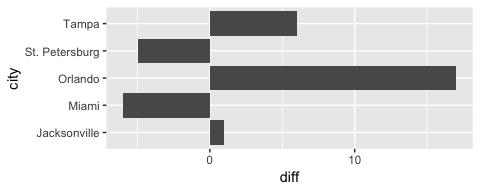<!-- -->

The plot can be improved by ordering the bars based on the difference in murder rate.

```r
ggplot(subset(murder_change, !is.na(diff) & state == "Florida"),
       aes(x = reorder(city, diff),
           y = diff)) +
  geom_bar(stat='identity') +
  coord_flip() +
  theme_light() +
  labs(x = "Difference in murders",
       y = "",
       title = "Change in murders 2014-2015")
```

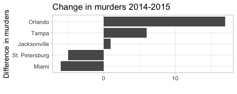<!-- -->

**Exercise** Please re-create the graph below as closely as possible. Hint: create a new data frame from `murder_change`, called `murder_change_av`, that adds a dummy variable coded 1 for observations that had above average murder rates in 2014 (taking into account only the year 2014), and 0 otherwise.

```r
murder_change_av <- murder_change %>%
  ungroup() %>%
  mutate(aboveav2014 = ifelse(murders >= mean(murders[year == 2014]), 1, 0)) %>%
  ungroup()

ggplot(subset(murder_change_av, !is.na(diff)),
       aes(x = reorder(city, diff),
           y = diff,
           fill = factor(aboveav2014))) +
  geom_bar(stat = 'identity') +
  coord_flip() +
  theme(axis.text.x = element_text(size = 1),
        legend.position = "none") +
  theme_light() +
  labs(title = "Drivers of increase in murder rates",
       y = "Change from 2014 to 2015",
       x = "") +
  scale_fill_manual(name = "Above average\nin 2014",
                    values = c("0" = "grey",
                               "1" = "orange"),
                    labels = c("No", "Yes"))
```

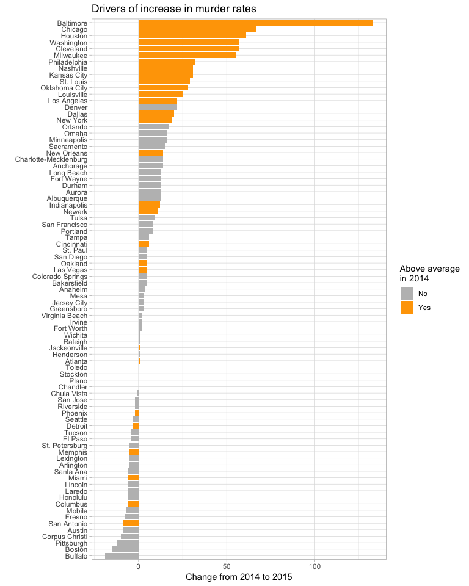<!-- -->

## `spread()`
Suppose we wanted to revert our operation (or generall shape data from a long to a wide format), we can use `tidyr`'s `spread()` function. The syntax is similar to `gather()`.

`new_df <- spread(old_df, key, value)`,

where `key` refers to the colum which contains the values that are to be converted to column names and `value` specifies the column that contains the value which is to be stored in the newly created columns.

For illustration purposes, we first remove the `diff` column below, because it leads to `NA` values when performing the `spread()` operation.

```r
murders_untidy <- murder_change %>%
  dplyr::select(-diff) %>%
  spread(year, murders)
head(murders_untidy)
```

```
## # A tibble: 6 x 5
## # Groups:   city [3]
##   city        state      diff_neg `2014` `2015`
##   <chr>       <chr>         <dbl>  <int>  <int>
## 1 Albuquerque New Mexico        0     NA     43
## 2 Albuquerque New Mexico       NA     30     NA
## 3 Anaheim     California        0     NA     18
## 4 Anaheim     California       NA     14     NA
## 5 Anchorage   Alaska            0     NA     26
## 6 Anchorage   Alaska           NA     12     NA
```


### An additional note on barplots
Lets go back to the `hflights` data. Suppose we wanted to know which airline operates the most flights out of either Houston airport. Here, we will be using the operator `n()` to tell `dplyr` to count all the observations for the groups specified in `group_by()`. After computing the result, I would like to arrange the output from highest number of flights to lowest number.

```r
carriers <- data %>%
  group_by(Airline) %>%
  summarise(NoFlights = n()) %>%
  arrange(desc(NoFlights))
```

We can display the result graphically using the `geom_bar()` aesthetic. Note the following details on the usage of `geom_bar()` from the `ggplot2` package documentation below.

*"The heights of the bars commonly represent one of two things: either a count of cases in each group, or the values in a column of the data frame. By default, geom_bar uses stat="bin". This makes the height of each bar equal to the number of cases in each group, and it is incompatible with mapping values to the y aesthetic. If you want the heights of the bars to represent values in the data, use stat="identity" and map a value to the y aesthetic."* (https://www.rdocumentation.org/packages/ggplot2/versions/1.0.1/topics/geom_bar)

Thus, the creating the count variables using `group_by()` and `summarise()` is not absolutely necessary. However, for more complicated groupings of data, I highly recommend creating a separate data frame and "hard code" groupings of interest before graphing.

```r
# Using default geom_bar(stat = "bin#) on the original data
ggplot(data,
       aes(x = Airline)) +
  geom_bar()
```

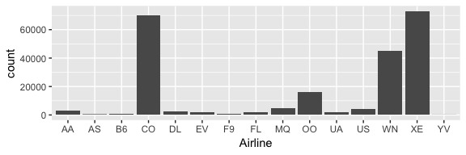<!-- -->

```r
# Using geom_bar(stat = "identity") on grouped data
ggplot(carriers,
       aes(x = Airline,
           y = NoFlights)) +
  geom_bar(stat = "identity")
```

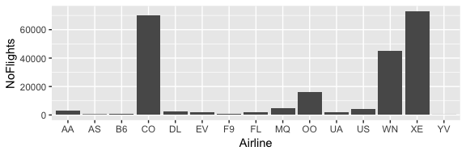<!-- -->


## `lubridate`
`lubridate` is another package in the `tidyverse` family that makes working with dates easier. Please refer to https://cran.r-project.org/web/packages/lubridate/vignettes/lubridate.html for more details on the package. Below, we use conflict event data from the ACLED data base. Please retrieve the ACLED event data from https://www.acleddata.com/data/ (Pakistan, selecting Battles and Violence against civilians). 


```r
library(lubridate)

# loading the ACLED data
library(readr)
acled <- read_csv("/Users/thereseanders/Documents/UNI/USC/Resources/R/workshop-dataviz-fsu/Day2/1900-01-01-2019-05-03-Pakistan.csv") 
acled_new <- acled %>%
  mutate(date = dmy(event_date)) %>%
  group_by(date, event_type) %>%
  summarise(count = n()) %>%
  ungroup() %>%

  # Using lubridate functions below
  mutate(year = year(date),
         month = month(date),
         day = day(date))


# Plotting it
ggplot() +
  geom_bar(data = subset(acled_new, year %in% seq(2013, 2018)),
           aes(x = date,
               y = count,
               fill = event_type),
           stat = "identity") +
  facet_wrap(~ year, scales = "free_x", ncol = 1) +
  theme_light()
```

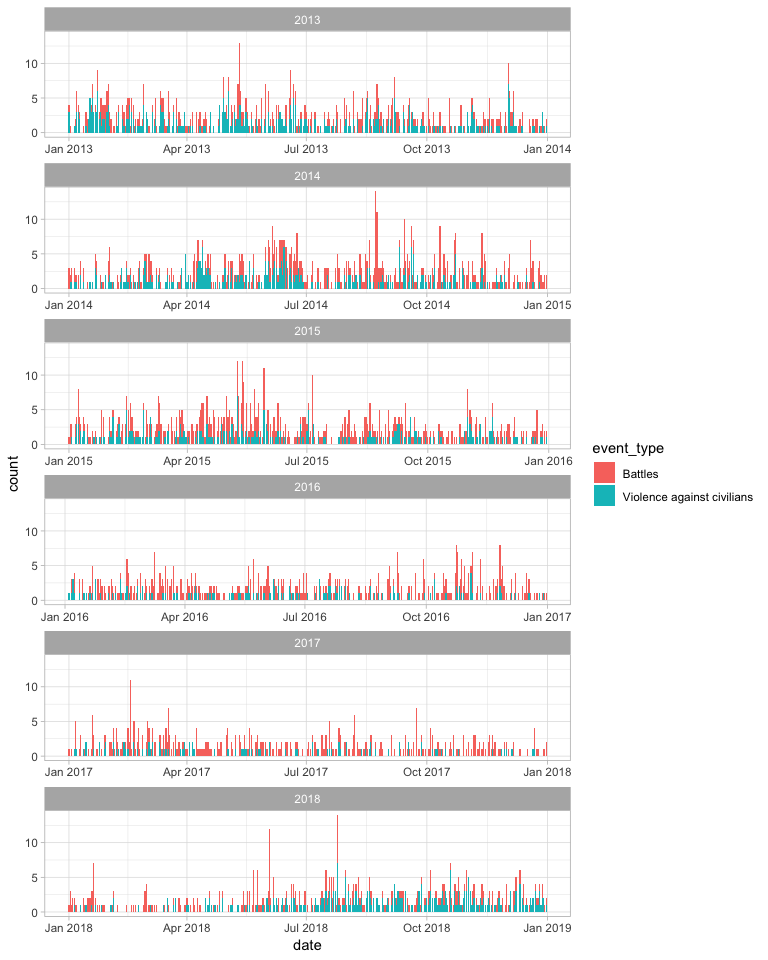<!-- -->


Does Ramadan have an effect on violence in Pakistan? We retrieve Ramadan dates from  http://www.ichild.co.uk/p/when-is-ramadan-2013-2014-2015-2016-2017-2018-2019-2020-2021-2022 and add a layer showing the month of Ramadan in the plot below. 

```r
# Intervals
ram <- c(interval(ymd("2013-07-09"), ymd("2013-08-07")),
         interval(ymd("2014-06-28"), ymd("2014-07-27")),
         interval(ymd("2015-06-18"), ymd("2015-07-17")),
         interval(ymd("2016-06-07"), ymd("2016-07-06")),
         interval(ymd("2017-05-27"), ymd("2017-06-25")),
         interval(ymd("2018-05-16"), ymd("2018-06-14")))

int_start(ram)
```

```
## [1] "2013-07-09 UTC" "2014-06-28 UTC" "2015-06-18 UTC" "2016-06-07 UTC"
## [5] "2017-05-27 UTC" "2018-05-16 UTC"
```

```r
df_ramadan <- data.frame(start = int_start(ram),
                         end = int_end(ram)) %>%
  mutate(year = year(start))


ggplot() +
  geom_bar(data = subset(acled_new, year %in% seq(2013, 2018)),
           aes(x = date,
               y = count,
               fill = event_type),
           stat = "identity") +
  facet_wrap(~ year, scales = "free_x", ncol = 1) +
  geom_rect(data = df_ramadan,
            aes(xmin = as.Date(start),
                xmax = as.Date(end),
                ymin = -Inf,
                ymax = Inf),
            alpha = 0.1,
            fill = "#BF8830") +
  theme_light() +
  scale_fill_manual(values = c("Battles" = "#071D70",
                               "Violence against civilians" = "#FF9E00")) +
  labs(title = "Violence in Pakistan",
       x = "",
       y = "Number of events")
```

<!-- -->

