# Day 2: Data Visualization in `R`

**FSU Summer Methods School**

Therese Anders

5/8/2019

# Visualizing regression results
Today, we will be working with the `politicalInformation` dataset from the `pscl` package.

```r
library(tidyverse)
```

```
## ── Attaching packages ─────────────────────────────────────────────── tidyverse 1.2.1 ──
```

```
## ✔ ggplot2 3.1.0       ✔ purrr   0.3.0  
## ✔ tibble  2.0.1       ✔ dplyr   0.8.0.1
## ✔ tidyr   0.8.3       ✔ stringr 1.4.0  
## ✔ readr   1.3.1       ✔ forcats 0.4.0
```

```
## ── Conflicts ────────────────────────────────────────────────── tidyverse_conflicts() ──
## ✖ dplyr::filter() masks stats::filter()
## ✖ dplyr::lag()    masks stats::lag()
```

```r
# install.packages("pscl")
library(pscl)
```

```
## Classes and Methods for R developed in the
## Political Science Computational Laboratory
## Department of Political Science
## Stanford University
## Simon Jackman
## hurdle and zeroinfl functions by Achim Zeileis
```

```r
head(pscl::politicalInformation)
```

```
##             y collegeDegree female age homeOwn govt length id
## 1 Fairly High           Yes     No  49     Yes   No  58.40  1
## 2     Average            No    Yes  35     Yes   No  46.15  2
## 3   Very High            No    Yes  57     Yes   No  89.52  3
## 4     Average            No     No  63     Yes   No  92.63  4
## 5 Fairly High           Yes    Yes  40     Yes   No  58.85  4
## 6     Average            No     No  77     Yes   No  53.82  4
```

We make a copy the original data set to an object called `dat` and create a new variable that codes an above average knowledge rating for the factor levels `Fairly High` and `Very High`. We also recode a number of factor variables

```r
dat <- pscl::politicalInformation %>%
  mutate(aboveav = ifelse(y %in% c("Fairly High", "Very High"), 1, 0),
         collegeDegree = case_when(
           collegeDegree == "Yes" ~ 1, 
           T ~ 0
         ),
         female = case_when(
           female == "Yes" ~ 1, 
           T ~ 0
         ))
```

First, lets plot the outcome variable by age. Unfortunately, we cannot see much because of overplotting.

```r
ggplot(dat,
       aes(x = age,
           y = aboveav)) +
  geom_point()
```

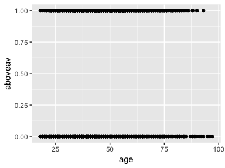<!-- -->


The graph suffers from overplotting. We can tweak the opacity and size of the points and use jitter to reduce its extent. Below, we also add a smoothing line to reduce overplotting in the graph.
<!-- -->

Does the effect vary by gender? Women have a lower probability of being classified as having above average political knowledge across all ages.

```r
names(dat)
```

```
## [1] "y"             "collegeDegree" "female"        "age"          
## [5] "homeOwn"       "govt"          "length"        "id"           
## [9] "aboveav"
```

```r
ggplot(dat,
       aes(x = age,
           y = aboveav,
           color = female)) +
  geom_point(position = position_jitter(height = 0.1),
             alpha = 0.2,
             size = 0.6) +
  theme_light() +
  geom_smooth() +
  labs(x = "Age",
       y = "Above average political knowledge")
```

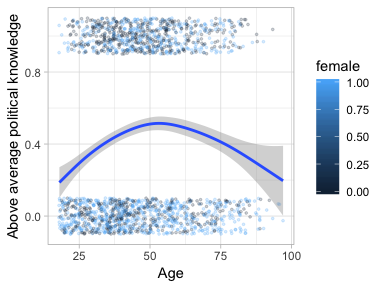<!-- -->


Lets run a regression (logit model) of the probability of the interviewers rating a person as above average on political knowledge.

```r
mod1 <- glm(aboveav ~ collegeDegree + female + length + age,
           data = dat,
           family = binomial(link = "logit"))
summary(mod1)
```

```
## 
## Call:
## glm(formula = aboveav ~ collegeDegree + female + length + age, 
##     family = binomial(link = "logit"), data = dat)
## 
## Deviance Residuals: 
##     Min       1Q   Median       3Q      Max  
## -2.0492  -0.8978  -0.6163   0.9707   1.9912  
## 
## Coefficients:
##                Estimate Std. Error z value Pr(>|z|)    
## (Intercept)   -1.830326   0.217325  -8.422  < 2e-16 ***
## collegeDegree  1.561435   0.107832  14.480  < 2e-16 ***
## female        -0.751004   0.105840  -7.096 1.29e-12 ***
## length         0.010903   0.002313   4.714 2.43e-06 ***
## age            0.011764   0.003250   3.620 0.000295 ***
## ---
## Signif. codes:  0 '***' 0.001 '**' 0.01 '*' 0.05 '.' 0.1 ' ' 1
## 
## (Dispersion parameter for binomial family taken to be 1)
## 
##     Null deviance: 2447.0  on 1790  degrees of freedom
## Residual deviance: 2125.5  on 1786  degrees of freedom
##   (16 observations deleted due to missingness)
## AIC: 2135.5
## 
## Number of Fisher Scoring iterations: 4
```
 
## Coefficient plot
There are a number of packages that offer off-the-shelf solutions to plotting coefficient plots for regression outcomes. In this workshop, we will create a coefficient plot manually. This will allow you to create coefficient plots for models that are not supported by existing packages.
 
Below, we extract properties of interest from the `mod1` object.

```r
str(summary(mod1)$coefficients)
```

```
##  num [1:5, 1:4] -1.8303 1.5614 -0.751 0.0109 0.0118 ...
##  - attr(*, "dimnames")=List of 2
##   ..$ : chr [1:5] "(Intercept)" "collegeDegree" "female" "length" ...
##   ..$ : chr [1:4] "Estimate" "Std. Error" "z value" "Pr(>|z|)"
```

```r
dimnames(summary(mod1)$coefficients)
```

```
## [[1]]
## [1] "(Intercept)"   "collegeDegree" "female"        "length"       
## [5] "age"          
## 
## [[2]]
## [1] "Estimate"   "Std. Error" "z value"    "Pr(>|z|)"
```

```r
# Note that dimnames() returns a list object, not a vector
df_mod1 <- data.frame(vars = dimnames(summary(mod1)$coefficients)[[1]],
                      coef = summary(mod1)$coefficients[,1],
                      se = summary(mod1)$coefficients[,2]) %>%
  
  # Computing CIs
  mutate(cilo_95 = coef - 1.96*se,
         cihi_95 = coef + 1.96*se,
         cilo_99 = coef - 2.56*se,
         cihi_99 = coef + 2.56*se) 
```

We can graph the coefficient plot using the `geom_point()` aesthetic for the coefficient and the `geom_linerange()` aesthetic for the 95% confidence intervals.

```r
ggplot(df_mod1,
       aes(x = vars,
           y = coef)) +
  geom_point() +
  geom_linerange(aes(ymin = cilo_95, ymax = cihi_95))
```

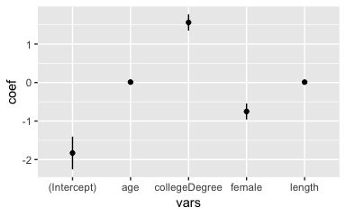<!-- -->

Let's add a thinner line for the 99% confidence confidence interval.

```r
ggplot(df_mod1,
       aes(x = vars,
           y = coef)) +
  geom_point() +
  geom_linerange(aes(ymin = cilo_95, ymax = cihi_95),
                 size = 1) +
  geom_linerange(aes(ymin = cilo_99, ymax = cihi_99),
                 size = 0.5)
```

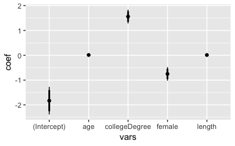<!-- -->

Finally, we flip the axes and order the coefficients based on their size to clean up the plot. We also add a line at zero to illustrate which coefficients are statistically significantly different from zero. Note that I add the zero line before the `geom_point()` aesthetic so it is in the background.

```r
ggplot(df_mod1,
       aes(x = reorder(vars, coef),
           y = coef)) +
  geom_hline(yintercept = 0, alpha = 0.8, linetype = "dashed") +
  geom_point() +
  geom_linerange(aes(ymin = cilo_95, ymax = cihi_95),
                 size = 1) +
  geom_linerange(aes(ymin = cilo_99, ymax = cihi_99),
                 size = 0.5) +
  coord_flip() +
  theme_light()
```

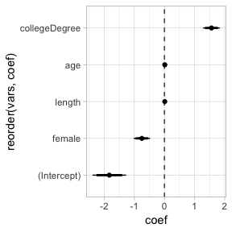<!-- -->

Suppose, we estimated another model that incorporates a quadratic term for age (since we saw from the earlier plot that age appears to have a curvilinear effect on the probability of being classified as above average on political knowledge). We can add these estimates to the data frame of regression results and plot them on the same coefficient plot to compare the results.

Below, I estimate a new model, `mod2` that includes the squared `age` variable. Note that I add an indicator for the model number `modnum` that we will later use to visually distinguish the results from both models.

```r
dat <- dat %>%
  mutate(age2 = age^2)
mod2 <- glm(aboveav ~ collegeDegree + female + length + age + age2,
           data = dat,
           family = binomial(link = "logit"))
summary(mod2)
```

```
## 
## Call:
## glm(formula = aboveav ~ collegeDegree + female + length + age + 
##     age2, family = binomial(link = "logit"), data = dat)
## 
## Deviance Residuals: 
##     Min       1Q   Median       3Q      Max  
## -2.1271  -0.9197  -0.5917   0.9889   2.2677  
## 
## Coefficients:
##                 Estimate Std. Error z value Pr(>|z|)    
## (Intercept)   -3.7864510  0.4695499  -8.064 7.38e-16 ***
## collegeDegree  1.5004697  0.1089346  13.774  < 2e-16 ***
## female        -0.7386554  0.1065092  -6.935 4.06e-12 ***
## length         0.0107528  0.0023223   4.630 3.65e-06 ***
## age            0.0985358  0.0184065   5.353 8.64e-08 ***
## age2          -0.0008448  0.0001761  -4.798 1.60e-06 ***
## ---
## Signif. codes:  0 '***' 0.001 '**' 0.01 '*' 0.05 '.' 0.1 ' ' 1
## 
## (Dispersion parameter for binomial family taken to be 1)
## 
##     Null deviance: 2447.0  on 1790  degrees of freedom
## Residual deviance: 2101.3  on 1785  degrees of freedom
##   (16 observations deleted due to missingness)
## AIC: 2113.3
## 
## Number of Fisher Scoring iterations: 4
```

```r
# Extracting the estimates
df_mod2 <- data.frame(vars = dimnames(summary(mod2)$coefficients)[[1]],
                      coef = summary(mod2)$coefficients[,1],
                      se = summary(mod2)$coefficients[,2]) %>%
  
  # Computing CIs
  mutate(cilo_95 = coef - 1.96*se,
         cihi_95 = coef + 1.96*se,
         cilo_99 = coef - 2.56*se,
         cihi_99 = coef + 2.56*se) %>%
  
  mutate(modnum = 2)
```

Below, I add a `modnum` indicator to the `mod1` data frame and create a joint dataframe using the `bind_rows()` function (similar to `rbind`). Note, that there are more efficient ways to run and combine the results of multiple regression models in a single data frame using loops and lists. We will not go into this in depth here.

```r
df_all <- df_mod1 %>%
  mutate(modnum = 1) %>%
  bind_rows(df_mod2)
```

I pass the `modnum` variable to both, the shape and the color parameter. We use `position = position_dodge()` to separate the lines and points for the two models. `ggplot2` recognizes the `modnum` variable as continuous and therefore does not want to map it to the shape parameter. We can turn `modnum` in a `factor` variable that can be mapped to a shape inside `aes()`. The graph shows that with the exception of the intercept, the model results are not altered much by the inclusion of the quadratic term.

```r
ggplot(df_all,
       aes(x = reorder(vars, coef),
           y = coef,
           color = factor(modnum),
           shape = factor(modnum))) +
  geom_hline(yintercept = 0, alpha = 0.8, linetype = "dashed") +
  geom_point(position = position_dodge(width = 0.3)) +
  geom_linerange(aes(ymin = cilo_95, ymax = cihi_95),
                 size = 1,
                 position = position_dodge(width = 0.3)) +
  geom_linerange(aes(ymin = cilo_99, ymax = cihi_99),
                 size = 0.3,
                 position = position_dodge(width = 0.3)) +
  coord_flip() +
  theme_light()
```

<!-- -->


## Predictive probabilities plot
Logit coefficients are themselves not very informative about effect size, in particular with regard to comparing the relative effect size of each coefficient. In addition, the explanatory variables are on different scales, which makes the effect sizes difficult to compare, both in numerical terms as well as in the coefficient plot above. We can illustrate the size of the effects by plotting the effect over the entire range of explanatory variables, holding all other variables at their mean.

```r
# Male, no college degree
scen_male <- expand.grid(collegeDegree = 0,
                         female = 0,
                         length = mean(dat$length, na.rm = T),
                         age = seq(min(dat$age, na.rm = T), max(dat$age, na.rm = T), 1)) %>%
  mutate(age2 = age^2)

# Below, get estimates on link scale, transform to predicted probabilities
# See https://stats.idre.ucla.edu/r/dae/logit-regression/
df_male <- cbind(scen_male, 
                 predict(mod2, newdata = scen_male, type = "link", se = TRUE)) %>%
  mutate(predProb = plogis(fit),
         cilo = plogis(fit - (1.96 * se.fit)),
         cihi = plogis(fit + (1.96 * se.fit))) 
```

Below, we use `geom_ribbon()` to graph the confidence interval around the age estimate.

```r
ggplot(df_male, 
       aes(x = age,
           y = predProb)) +
  geom_line() +
  geom_ribbon(aes(ymin = cilo, ymax = cihi),
              alpha = 0.3)
```

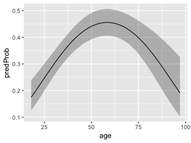<!-- -->

**Exercise** Suppose we wanted to compare the effect of age on recorded political knowledge for male and female respondents. 

Please compute the predicted probability of being classified as having above average political knowledge for female respondents, combine the two data frames into one, and graph the results for both male and female respondents in the same plot. Try to re-create the graph below as closely as possible.


```r
scen_female <- expand.grid(collegeDegree = 0,
                         female = 1,
                         length = mean(dat$length, na.rm = T),
                         age = seq(min(dat$age, na.rm = T), max(dat$age, na.rm = T), 1)) %>%
  mutate(age2 = age^2)

df_both <- cbind(scen_female, 
                 predict(mod2, newdata = scen_female, type = "link", se = TRUE)) %>%
  mutate(predProb = plogis(fit),
         cilo = plogis(fit - (1.96 * se.fit)),
         cihi = plogis(fit + (1.96 * se.fit))) %>%
  bind_rows(df_male)

#plotting effect for male and female respondents
ggplot(df_both, 
       aes(x = age,
           y = predProb,
           color = factor(female),
           fill = factor(female))) +
  geom_line() +
  geom_ribbon(aes(ymin = cilo, ymax = cihi),
              alpha = 0.3,
              color = NA) +
  
  # adjusting the appearance of the plot
  scale_color_manual(values = c("0" = "darkblue", 
                                "1" = "darkorange"),
                     name = "",
                     labels = c("Male", "Female")) +
  scale_fill_manual(values = c("0" = "darkblue", 
                                "1" = "darkorange"),
                     name = "",
                     labels = c("Male", "Female")) +
  theme_light() +
  labs(x = "Age",
       y = "Predicted probability of above average",
       title = "Effect of age and gender on political knowledge") +
  coord_cartesian(ylim = c(0,0.6))
```

<!-- -->


# Maps in R
## Using `geom_polygon()`
The `R` programming environment offers many powerful tools for the visualization and analysis of spatial data. In this workshop, we focus on the visualization of data using maps. There is a myriad of packages for and approaches to creating maps in `R`. We concentrate on visualizing spatial data with the `ggplot2`  package.

In this first exercise, we will use map data that is part of the `maps` package in `R` and does not require significant preprocessing before plotting. The `maps` package (https://cran.r-project.org/web/packages/maps/index.html) contains data on lines and polygons for a number of geographical units, including but not limited to, countries of the world, a database of large lakes, as well as United States federal states, counties, and cities.


As a first example, we will create a simple map of the continental United States. We draw the data from the `maps` package and plot it using `ggplot2`.

```r
# install.packages("maps")
library(maps)
states_map <- map_data("state")
```

Let us look at the structure of the data we drew from `maps`. The data is stored as a data frame and contains observations that are characterized by unique combinations of longitude and latitude values. Each observation has the following attributes: group, order, region, and subregion if applicable. 

```r
head(states_map)
```

```
##        long      lat group order  region subregion
## 1 -87.46201 30.38968     1     1 alabama      <NA>
## 2 -87.48493 30.37249     1     2 alabama      <NA>
## 3 -87.52503 30.37249     1     3 alabama      <NA>
## 4 -87.53076 30.33239     1     4 alabama      <NA>
## 5 -87.57087 30.32665     1     5 alabama      <NA>
## 6 -87.58806 30.32665     1     6 alabama      <NA>
```

The `group` and `order` variables in the data set code relational information of the points. For example, there are 49 regions (all states minus Alaska and Hawaii, plus District of Columbia), 63 groups, and a varying number of points (observations) within each group. The observations denote the border points we plotted previously, and the order counter establishes the sequence in which they should be plotted.

```r
head(table(states_map$region))
```

```
## 
##     alabama     arizona    arkansas  california    colorado connecticut 
##         202         149         312         516          79          91
```

We can use `ggplot2`'s `geom_polygon()` function to plot the observations as polygons, rather than points. In order to do that, we need to specify the grouping parameter. If the data wasn't ordered correctly, we could use the `arrange()` function in the `dplyr` package to establish the correct sequencing of points for each polygon (see demonstration below).

```r
ggplot(states_map, aes(x = long, 
                       y = lat, 
                       group = group)) +
  geom_polygon()
```

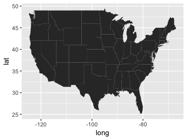<!-- -->

```r
# Demonstration: messing up the order
states_map_unordered <- states_map %>%
  arrange(long)
ggplot(states_map_unordered, aes(x = long, 
                       y = lat, 
                       group = group)) +
  geom_polygon()
```

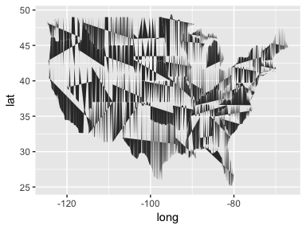<!-- -->

We are operating within the normal `ggplot2` environment, so all regular graphing parameters can be used with maps as well.

```r
ggplot(states_map, aes(x = long, 
                       y = lat, 
                       group = group)) +
  geom_polygon(fill = "darkolivegreen", 
               color = "lightgrey", 
               alpha = 0.5) +
  theme_light()
```

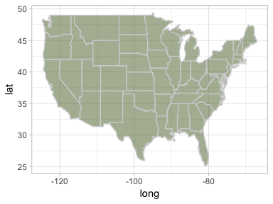<!-- -->

The map appears to be a bit "squished". This is because the scaling of the x-axis and y-axis is not based on the scaling of longitude and latitude. We can pass special mapping parameters to `ggplot2` via the `coord_map()` command to achieve the right aspect ratio or use different map projections.

```r
ggplot(states_map, aes(x = long, 
                       y = lat, 
                       group = group)) +
  geom_polygon(fill = "darkcyan", 
               color = "darkblue", 
               alpha = 0.5) +
  theme_minimal() +
  coord_map()
```

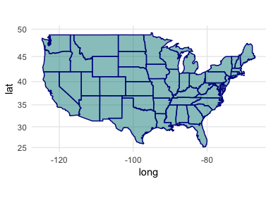<!-- -->


```r
ggplot(states_map, aes(x = long, 
                       y = lat, 
                       group = group)) +
  geom_polygon(fill = "darkcyan", 
               color = "darkblue", 
               alpha = 0.5) +
  theme_minimal() +
  coord_map("polyconic")
```

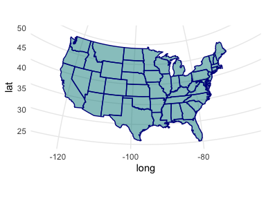<!-- -->

If you need world maps that capture the historic borders of countries, take a look at Nils Weidmann, Doreen Kuse, and Kristian S. Gleditsch's `cshapes()` package.


### Plotting points on a map
`ggplot2` allows for plotting in layers. We can use this feature to add points to our map of the continental US. For ease, we will use the data included in the `maps` package. The `us.cities` database contains information on US cities with a population greater than 40,000 and all state capitals. The database contains information on cities in Hawaii and Alaska as well. We will drop these observations before plotting them on our map of the continental US using the `dplyr` package.

```r
cities <- us.cities
table(cities$country.etc)
```

```
## 
##  AK  AL  AR  AZ  CA  CO  CT  DC  DE  FL  GA  HI  IA  ID  IL  IN  KS  KY 
##   2  11   9  21 208  21  21   1   2  76  15   2  10   7  42  19  11   6 
##  LA  MA  MD  ME  MI  MN  MO  MS  MT  NC  ND  NE  NH  NJ  NM  NV  NY  OH 
##  10  47  23   2  36  20  15   6   4  20   3   4   4  36   7  10  25  28 
##  OK  OR  PA  RI  SC  SD  TN  TX  UT  VA  VT  WA  WI  WV  WY 
##  10  13  16   6   7   3  12  71  13  25   1  24  16   2   2
```

```r
library(dplyr)
cities_sub <- cities %>%
  filter(!(country.etc %in% c("AK", "HI")))
```


We plot the `cities_sub` data as an additional layer on top of the map of the continental US.

```r
ggplot() +
  geom_polygon(data = states_map, 
               aes(x = long,
                   y = lat,
                   group = group),
               fill = "lightgrey", 
               color = "black", 
               size = 0.2, 
               alpha = 0.2) +
  theme_light() +
  coord_map() +
  geom_point(data = cities_sub, 
             aes(x = long, 
                 y = lat),
             alpha = 0.8) +
  labs(title = "Cities with over 40,000 inhabitants")
```

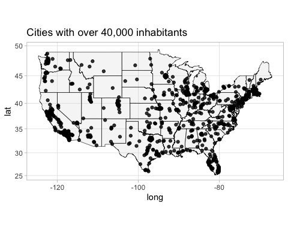<!-- -->

Again, we can use `ggplot2`'s regular graphing options in maps. In the following map we will use different colors for state capitals and denote the population of the cities through the size of the points.

```r
table(cities_sub$capital)
```

```
## 
##   0   2 
## 953  48
```

```r
ggplot() +
  geom_polygon(data = states_map, 
               aes(x = long, 
                   y = lat, 
                   group = group),
               fill = "lightgrey", 
               color = "black", 
               size = 0.2, 
               alpha = 0.2) +
  theme_minimal() +
  coord_map() +
  geom_point(data = cities_sub, aes(x = long, 
                                    y = lat, 
                                    color = factor(capital),
                                    size = pop),
             alpha = 0.7) +
  scale_color_manual(values = c("0" = "darkgrey", 
                                "2" = "red"), 
                     labels = c("City over 40,000", 
                                "State Capital"),
                     name = "Type") +
  scale_size_continuous(name = "Population") +
  theme(legend.position = "bottom") +
  labs(title = "Cities with over 40,000 inhabitants")
```

<!-- -->

### Adding text
We can also use the names of the observations to label the state capitals.

```r
ggplot() +
  geom_polygon(data = states_map, 
               aes(x = long, 
                   y = lat, 
                   group = group),
               fill = "lightgrey", 
               color = "black", 
               size = 0.2, 
               alpha = 0.2) +
  theme_minimal() +
  coord_map() +
  geom_point(data = cities_sub, aes(x = long, 
                                    y = lat, 
                                    color = factor(capital),
                                    size = pop),
             alpha = 0.6) +
  scale_color_manual(values = c("0" = "darkgrey", 
                                "2" = "red"), 
                     labels = c("City over 40,000", "State Capital"),
                     name = "Type") +
  scale_size_continuous(name = "Population") +
  theme(legend.position = "bottom") +
  geom_text(data = subset(cities_sub, capital == 2),
            aes(x = long, y = lat, label = name),
            size = 2.5) +
  labs(title = "US state capitals and cities with over 40,000 inhabitants",
       x = "",
       y = "")
```

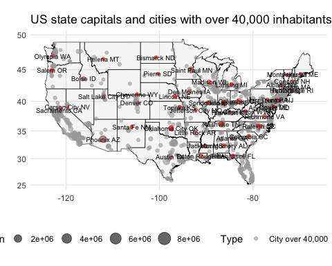<!-- -->

### Subsetting maps
Since the spatial data is stored in a normal database, we can use subsetting to create maps of geographic units contained within a larger spatial database. For example, we could plot a map of Florida using the data from the `maps` package. We can either subset the data before plotting, or use the subset function when specifying the data frame within `ggplot2`.


```r
ggplot(subset(states_map, 
              region == "florida"), 
       aes(x = long, 
           y = lat, 
           group = group)) +
  geom_polygon() +
  coord_map()
```

<!-- -->

## `sf` package
`sf` (simple features) is a package for manipulating and analyzing spatial data in `R` (see https://github.com/r-spatial/sf). 

One of the most commonly used sources of shape files is the Global Administrative Areas Database (GADM, http://www.gadm.org) that offers shape files for the administrative boundaries for most countries of the world free of charge. Which administrative boundaries are available varies by country. For example, for the United States, we have shape files at levels 0 (country), 1 (state), and 2 (county). For India, shape files are available for levels 0 (country), 1 (state), 2 (district), and 3 (taluk).

Below, we get data from GADM database via the `raster` package. Data from the GADM by default is stored as a `SpatialPolygonsDataFrame` object. Take a look at the structure of the `SpatialPolygonsDataFrame` below using `View()`.

```r
library(raster)
```

```
## Loading required package: sp
```

```
## 
## Attaching package: 'raster'
```

```
## The following object is masked from 'package:dplyr':
## 
##     select
```

```
## The following object is masked from 'package:tidyr':
## 
##     extract
```

```r
# Entire country as 1 geom 
pak0 <- getData('GADM', country = 'PAK', level = 0)
# View(pak0)

# Districts
pak3 <- getData('GADM', country = 'PAK', level = 3) 
```

Sometimes plotting maps is a very slow process, especially if many border points are used to plot polygons. Below, we use the `ms_simplify()` function from the `rmapshaper` package to simplify the `SpatialPolygonsDataFrame` (i.e. use fewer points to represent the polygon). We can then transform it to a simple feature (`sf`) object using `st_as_sf()`; using a pipe to connect the operations.

```r
library(sf)
```

```
## Linking to GEOS 3.6.1, GDAL 2.1.3, PROJ 4.9.3
```

```r
library(rmapshaper)

pak3_simple <- ms_simplify(input = pak3, 
                           keep = 0.015) %>%
  st_as_sf()
```

We can plot the `sf` object using `geom_sf()`.

```r
ggplot() +
  geom_sf(data = pak3_simple)
```

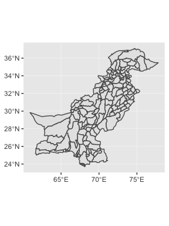<!-- -->


## Adding events to the map
We use the same ACLED data on battles and violence against civilians as in the previous session We use the `st_as_sf()` function to turn the data into an `sf` object. To plot the data, we need to set a coordinate reference system (crs) inside `st_as_sf()`. Here, we use CRS wgs84 (http://download.geonames.org/export/dump/readme.txt).

```r
library(readr) #contains read_csv() function
library(lubridate)
acled <- read_csv("/Users/thereseanders/Documents/UNI/USC/Resources/R/workshop-dataviz-fsu/Day2/1900-01-01-2019-05-03-Pakistan.csv") 
names(acled)
```

```
##  [1] "data_id"          "iso"              "event_id_cnty"   
##  [4] "event_id_no_cnty" "event_date"       "year"            
##  [7] "time_precision"   "event_type"       "sub_event_type"  
## [10] "actor1"           "assoc_actor_1"    "inter1"          
## [13] "actor2"           "assoc_actor_2"    "inter2"          
## [16] "interaction"      "region"           "country"         
## [19] "admin1"           "admin2"           "admin3"          
## [22] "location"         "latitude"         "longitude"       
## [25] "geo_precision"    "source"           "source_scale"    
## [28] "notes"            "fatalities"       "timestamp"       
## [31] "iso3"
```

```r
acled_sf <- acled %>%
  
  # using lubidate to re-format the event_date
  mutate(date = dmy(event_date)) %>%
  
  # turning data frame into sf object and setting crs
  st_as_sf(coords = c("longitude", 
                      "latitude"),
           crs = 4326)

# Make sure CRS is the same
st_crs(acled_sf)
```

```
## Coordinate Reference System:
##   EPSG: 4326 
##   proj4string: "+proj=longlat +datum=WGS84 +no_defs"
```

```r
st_crs(pak3_simple)
```

```
## Coordinate Reference System:
##   EPSG: 4326 
##   proj4string: "+proj=longlat +datum=WGS84 +no_defs"
```

We plot the events to the map adding another `geom_sf()` layer. Below, we subset the `acled_sf` dataframe to the year 2015 to reduce the number of points to plot.

```r
ggplot() +
  geom_sf(data = pak3_simple) +
  geom_sf(data = subset(acled_sf, year == 2015))
```

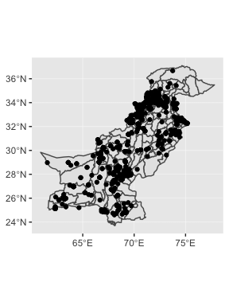<!-- -->

We can use the `ggplot2` grammar of graphics on spatial data. Below, we plot a separate plot per year and distinguish between battle events and events involving violence against civilians with the fill and shape aesthetics. The graph takes a moment to render. 

```r
ggplot() +
  geom_sf(data = pak3_simple,
          color = "grey",
          fill = "lightgrey",
          alpha = 0.4) +
  geom_sf(data = subset(acled_sf, year %in% seq(2016, 2018)),
          aes(color = event_type,
              shape = event_type),
          alpha = 0.5) +
  facet_wrap(~ year, nrow = 1) +
  theme_light() +
  coord_sf()
```

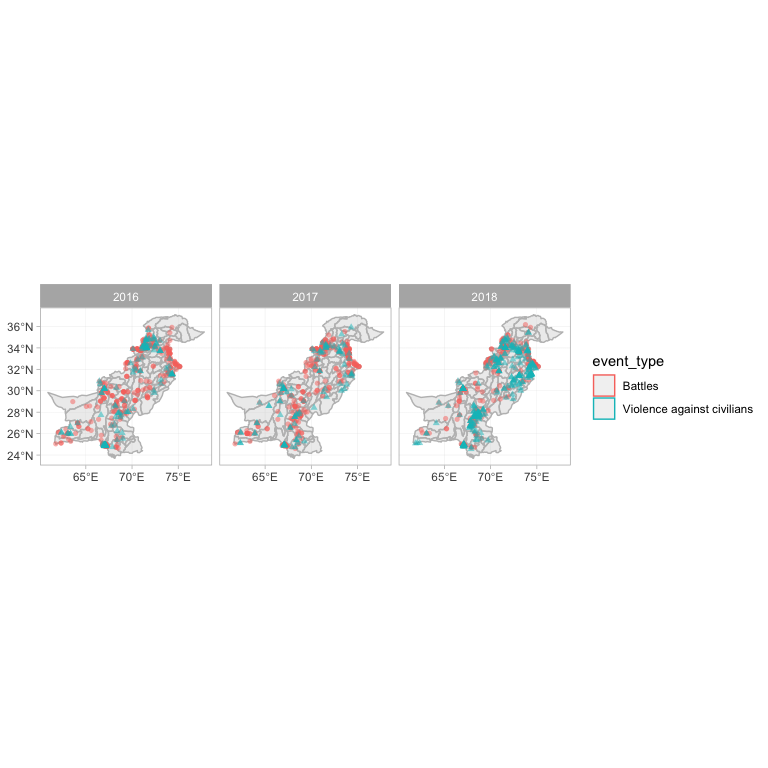<!-- -->

## Choropleth maps
Choropleth maps use differences in shading of specific geographic regions to visualize data. 

We can use the `st_join()` function to merge the points and polygons data frame. Here, we implicitly declare `pak3_simple` to be the master data frame, and "add on" acled_sf. This preserves the geometry of the polygons and adds on events data by duplicating the respective polygon information.

We can then compute the number of events per polygon using the `group_by()` and `summarize()` functions.

Note that below, there are a number of polygons that do not experience any events from our ACLED excerpt, which causes the polygon to be dropped. We therefore drop the `geometry` column using `st_set_geometry(NULL)`. We then set up an empty data frame with all possible observations using `expand.grid()` and regular `left_join()` operations (joining a data frame and an `sf` object): a) for the polygon data from `pak3_simple` and b) `df_sum` that contains the summary information.

```r
df_sum <- pak3_simple %>%
  st_join(acled_sf) %>%
  group_by(NAME_3, event_type, year) %>%
  summarise(fatal = sum(fatalities, na.rm = T),
            eventcount = n()) %>%
  st_set_geometry(NULL)
```

```
## although coordinates are longitude/latitude, st_intersects assumes that they are planar
```

```r
df_full <- expand.grid(NAME_3 = unique(pak3_simple$NAME_3),
                       year = unique(acled_sf$year),
                       event_type = c("Battles", "Violence against civilians")) %>%
  left_join(pak3_simple) %>%
  left_join(df_sum)
```

```
## Joining, by = "NAME_3"
```

```
## Warning: Column `NAME_3` joining factor and character vector, coercing into
## character vector
```

```
## Joining, by = c("NAME_3", "year", "event_type")
```

```
## Warning: Column `event_type` joining factor and character vector, coercing
## into character vector
```

We can now map, for example, the `eventcount` variable to the `fill` inside `geom_sf()`. To reduce the number of data plotted, we subset the data to the years 2016, 2017, and 2018 and plot each year in a separate facet.

```r
ggplot() +
  geom_sf(data = subset(df_full, year %in% seq(2016, 2018)),
          aes(fill = eventcount),
          color = "grey") +
  facet_wrap(~ year) +
  scale_fill_gradientn(colors = c("white", "orange", "darkorange", "red", "darkred"),
                       name = "Number of Events",
                       na.value = "white") +
  theme_light()
```

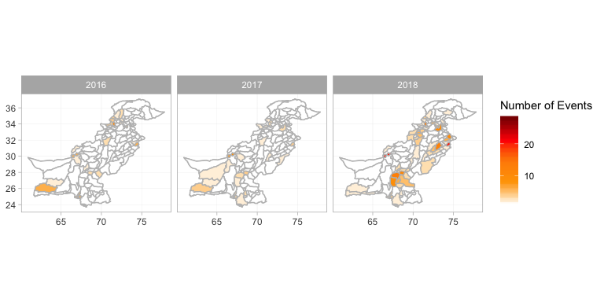<!-- -->

We can further distinguish between the two event types using `facet_grid()`.

```r
ggplot() +
  geom_sf(data = subset(df_full, year %in% seq(2016, 2018)),
          aes(fill = eventcount),
          color = "grey") +
  facet_grid(event_type ~ year) +
  scale_fill_gradientn(colors = c("white", "orange", "darkorange", "red", "darkred"),
                       name = "Number of Events",
                       na.value = "white") +
  theme_light() +
  coord_sf()
```

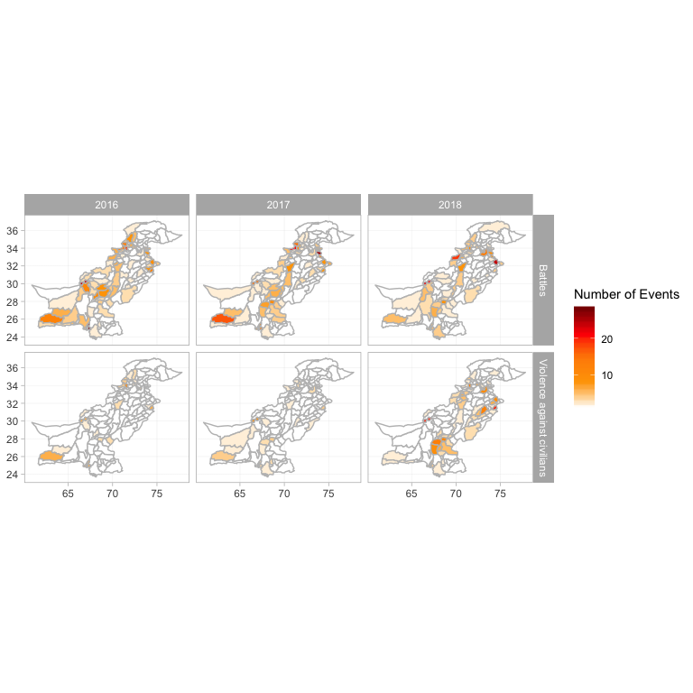<!-- -->


## Using Stamen map server in `R`
An alternative to shape files is the use of online map data as the basis for the visualization of spatial data. The `ggmap` and `tmaptools` packages allow us to directly query the Google Maps or Stamen Maps servers for a map. Note that due to a recent change in the access policy to Google Maps, you need a google maps API access key to access Google Maps using `ggmap`. In this tutorial, we will use a map from [Stamen](http://maps.stamen.com/#watercolor/12/37.7706/-122.3782).


```r
# Accessing Stamen map
# https://stackoverflow.com/questions/52704695/is-ggmap-broken-basic-qmap-produces-arguments-imply-differing-number-of-rows/52710855#52710855
library(tmaptools)
library(ggmap)
# default is watercolor
la <- ggmap(get_stamenmap(rbind(as.numeric(paste(geocode_OSM("Los Angeles county")$bbox))), 
                          zoom = 8))
la
```

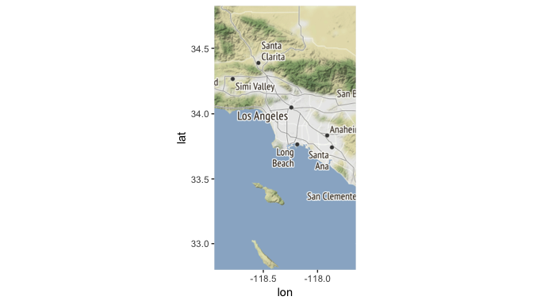<!-- -->

We can change the appearance of the plot using the `maptype` parameter. To get a list of all types for Stamen maps, see `??get_stamenmap`.

```r
la_bw <- ggmap(get_stamenmap(rbind(as.numeric(paste(geocode_OSM("Los Angeles county")$bbox))), 
                          zoom = 8,
                          maptype = "toner-lite"))
la_bw
```

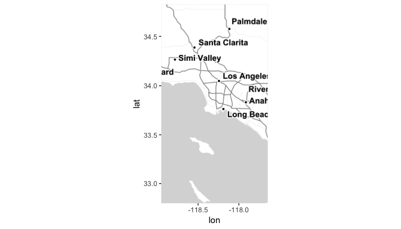<!-- -->

### Assessing Los Angeles Air Quality
We can plot additional information on the maps we retrieved from Google Maps. As an example, let us consider air quality measurements. As of Spring 2019, the United States Environmental Protection Agency (EPA) still publishes fine-grained geo-coded data on their air quality measurement stations. Here we use a data file that contains 24-hour average fine particulate matter (PM2.5, Federal Reference Method) readings for all US measurement stations in 2018 (Source: file `daily_88101_2018.zip` from https://aqs.epa.gov/aqsweb/airdata/download_files.html#AQI). Unzip the file and load the csv using `read_csv()` from the `readr` package below.

```r
library(readr)
aqi <- read_csv("daily_88101_2018.csv")
```

```
## Parsed with column specification:
## cols(
##   .default = col_character(),
##   `Parameter Code` = col_double(),
##   POC = col_double(),
##   Latitude = col_double(),
##   Longitude = col_double(),
##   `Date Local` = col_date(format = ""),
##   `Observation Count` = col_double(),
##   `Observation Percent` = col_double(),
##   `Arithmetic Mean` = col_double(),
##   `1st Max Value` = col_double(),
##   `1st Max Hour` = col_double(),
##   AQI = col_double(),
##   `Method Code` = col_double(),
##   `Date of Last Change` = col_date(format = "")
## )
```

```
## See spec(...) for full column specifications.
```

```r
names(aqi)
```

```
##  [1] "State Code"          "County Code"         "Site Num"           
##  [4] "Parameter Code"      "POC"                 "Latitude"           
##  [7] "Longitude"           "Datum"               "Parameter Name"     
## [10] "Sample Duration"     "Pollutant Standard"  "Date Local"         
## [13] "Units of Measure"    "Event Type"          "Observation Count"  
## [16] "Observation Percent" "Arithmetic Mean"     "1st Max Value"      
## [19] "1st Max Hour"        "AQI"                 "Method Code"        
## [22] "Method Name"         "Local Site Name"     "Address"            
## [25] "State Name"          "County Name"         "City Name"          
## [28] "CBSA Name"           "Date of Last Change"
```

```r
table(aqi$`Sample Duration`)
```

```
## 
##        1 HOUR       24 HOUR 24-HR BLK AVG 
##        129409         57616        122728
```

```r
aqi_la <- aqi %>%
  filter(`Sample Duration` == "24 HOUR") %>%
  filter(`County Name` == "Los Angeles")
```

Below, we compute the median fine particulate matter air quality index for each LA county site in 2018.

```r
table(aqi_la$`Local Site Name`)
```

```
## 
##                          Azusa                        Compton 
##                             60                             57 
##             Long Beach (North)             Long Beach (South) 
##                            168                            167 
## Long Beach-Route 710 Near Road  Los Angeles-North Main Street 
##                            177                            205 
##                       Pasadena                 Pico Rivera #2 
##                             90                             84 
##                         Reseda 
##                             54
```

```r
aqi_la_summary <- aqi_la %>%
  
  # Grouping by Longitude, Latitude, `Local Site Name` to retain variables
  dplyr::group_by(Longitude, Latitude, `Local Site Name`) %>%
  dplyr::summarise(median_aqi = median(AQI, na.rm = T))
```

We then plot the air quality data onto the map of Los Angeles we retrieved from Stamen maps above, letting the color of the points represent the median air quality index for each station.

```r
la_bw +
  geom_point(data = aqi_la_summary, 
             aes(x = Longitude, 
                 y = Latitude, 
                 color = median_aqi), 
             size = 10, 
             alpha = 0.7) +
  scale_color_gradient(low = "green", 
                       high = "red", 
                       name = "Median PM2.5") +
  labs(title = "LA County Air Quality Index for\nFine Particulate Matter in 2018") +
  coord_map(ylim = c(33.5, 34.8))
```

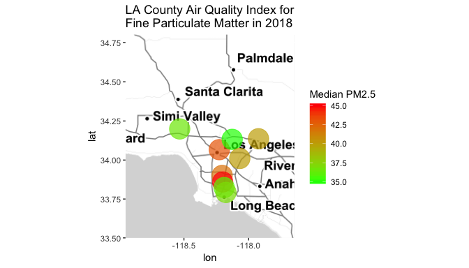<!-- -->

## Density Map of Fine Particulate Matter Pollution
According to the EPA, fine particulate matter PM2.5 should not exceed 35 microcrams per cubic meter of air in a 24-hour average (https://www.epa.gov/criteria-air-pollutants/naaqs-table). Rather than looking at the annual median value of the air quality standard to assess the level of air pollution, we could measure the number of times a station reading exceeds this standard. 

To do this for the continental states, we use a subset of our earlier U.S. states map from the `maps` package. Below, we create an `sf` object from the "state" map.

```r
us_map <- st_as_sf(map("state", 
                       plot = FALSE, 
                       fill = TRUE))

ggplot(us_map) +
  geom_sf()
```

<!-- -->

We then subset the 2018 EPA data to include only cases where the 24-hour average PM2.5 reading exceeded the 35 microcrams per cubic meter of air standard.

```r
pm25 <- aqi %>%
  dplyr::filter(`Sample Duration` == "24 HOUR") %>%
  dplyr::filter(`Arithmetic Mean` >= 35,
                !(`State Name` %in% c("Hawaii", "Alaska")))
```

Finally, we plot the density of observations that exceed the daily air quality standard on the map using `ggplot2`'s `stat_density2d()` function. Note that we are not mapping a specific variable, but rather plot the frequency and clustering of observations in our `pm25` subset of all station readings in 2018. This is achieved through the `..level..` argument that is passed to the `fill` parameter inside the `stat_density2d()` function.

```r
ggplot() +
  geom_sf(data = us_map) +
  geom_point(data = pm25, 
                 aes(x = Longitude, 
                     y = Latitude),
             alpha = 0.5,
             color = "red")
```

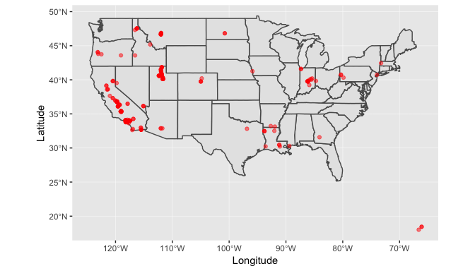<!-- -->

```r
ggplot() +
  geom_sf(data = us_map) +
  stat_density2d(data = pm25, 
                 aes(x = Longitude, 
                     y = Latitude,
                     
                     #mapping observations not any specific variable
                     fill = stat(level)),
                 
                 alpha = 0.4,
                 geom = "polygon") +
  scale_fill_gradient(low = "black", high = "red", 
                       name = "Density of daily\nair quality exceeding\nPM2.5 Standard") +
  labs(title = "Fine Particulate Matter Pollution in 2018")
```

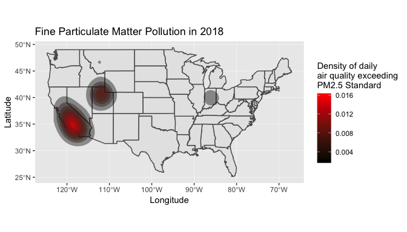<!-- -->
`

